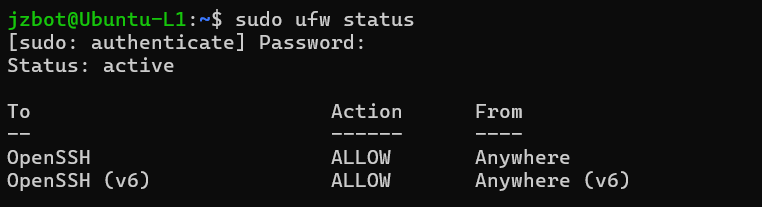
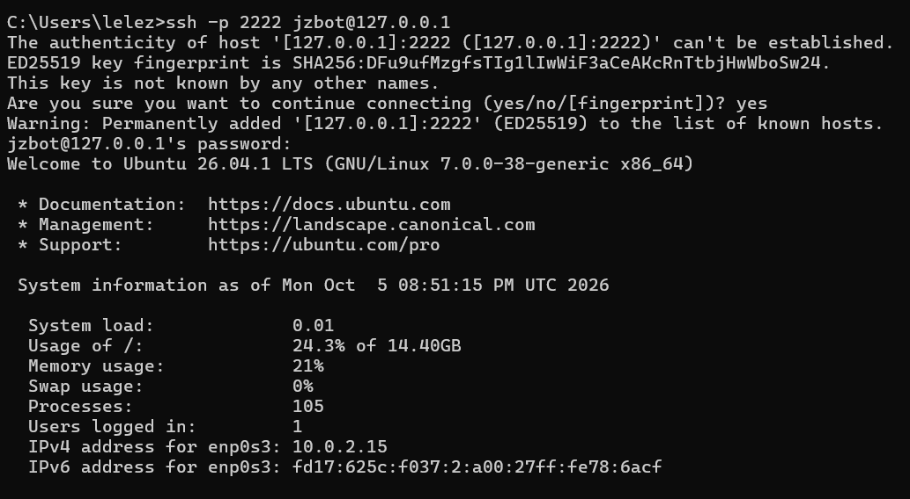

# Level 1: Virtualization & Networking Fundamentals

## Goal
Stand up a single, isolated Linux server VM and confirm basic connectivity 
before layering on any complexity.

## What I Built
- **Hypervisor:** VirtualBox on Windows host
- **VM:** Ubuntu Server 26.04.1 LTS (1 CPU, 2GB RAM, 20GB dynamically allocated disk)
- **Networking:** NAT adapter with port forwarding (host port 2222 → guest port 22)
- **Access:** SSH from Windows host into the VM
- **Security:** UFW firewall enabled, allowing only OpenSSH traffic

## Steps Taken
1. Installed VirtualBox and downloaded the Ubuntu Server 26.04.1 ISO
2. Created a new VM (2GB RAM, 20GB dynamic disk) and attached the ISO
3. Ran through the Ubuntu installer, created a user account
4. Set the network adapter to NAT and configured port forwarding 
   (TCP, host port 2222 → guest port 22)
5. Installed OpenSSH server manually after discovering it wasn't included 
   by default (`sudo apt install openssh-server`)
6. Verified the SSH service was active (`sudo systemctl status ssh`)
7. Connected successfully from Windows: `ssh -p 2222 jzbot@127.0.0.1`
8. Enabled UFW and allowed OpenSSH: 
   `sudo ufw allow OpenSSH` → `sudo ufw enable`
9. Took a VirtualBox snapshot to preserve this working state

## Troubleshooting Notes
- **Initial SSH error:** `kex_exchange_identification: read: Connection aborted`
  - **Cause:** OpenSSH server package was never installed during setup
  - **Fix:** `sudo apt install openssh-server -y`, then verified with 
    `systemctl status ssh`
- Confirmed NAT + port forwarding requires connecting to `127.0.0.1` on 
  the host, not the VM's internal `10.0.2.15` address

## What I Learned
- The difference between VirtualBox's network adapter modes (NAT, Bridged, 
  Host-Only, Internal Network) and when to use each
- How NAT port forwarding routes a host port into a guest VM's port
- Basic Linux service management with `systemctl`
- Firewall fundamentals with `ufw`, default-deny with explicit allow rules

## Milestone: ✅ Complete
Two VMs (Ubuntu Server, with Kali to follow) reachable via SSH, firewall 
active, snapshot taken.

---
*Part of an ongoing home lab project — see root README for the full 
[learning path](link-to-your-doc-if-you-publish-it) across all levels.*
